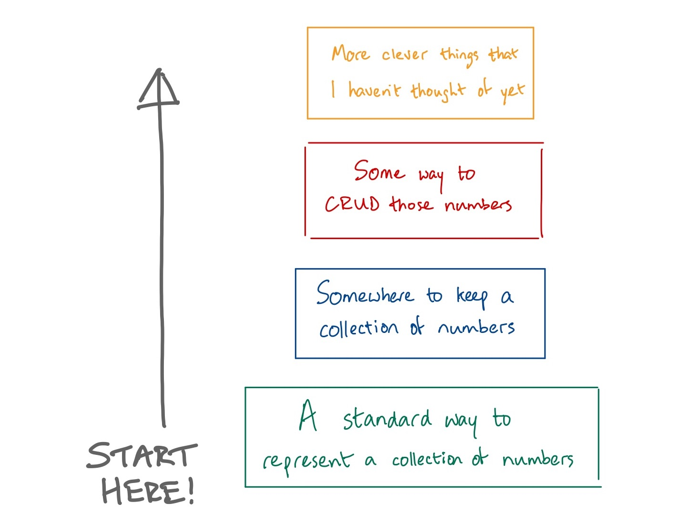

# Creating a language, part I: define the language

The idea of [Johnny.Decimal](https://johnnydecimal.com) is well formed. It works, as a concept.

My struggle has always been with the _management_ of the system. It's the page I dislike the most on the site: [tracking your numbers](https://johnnydecimal.com/concepts/tracking-your-numbers/). It feels incomplete, because it is incomplete.

I've tried all sorts of things, over the years. Spreadsheets, notes, databases – you name it, I've stored my Johnny.Decimal database in it. But none of them have stuck.

It's been obvious to me that I need to write something custom to support the system. Now, I still have no idea what that thing is. But let's go back to basics: what is the minimum that I need to get started? What's the foundation at the base of this thing?

The first thing I need to do is decide on some notation, some standard way to represent a collection of numbers.

I'm a massive fan of John Gruber's [Markdown](https://daringfireball.net/projects/markdown/). It's a simple, human-readable, documented standard that anyone can just use. This one's a no-brainer: mine needs to be the same.

#### Design decision 1

> **The standard way to represent a collection of JD numbers will be human-readable plain text**.

