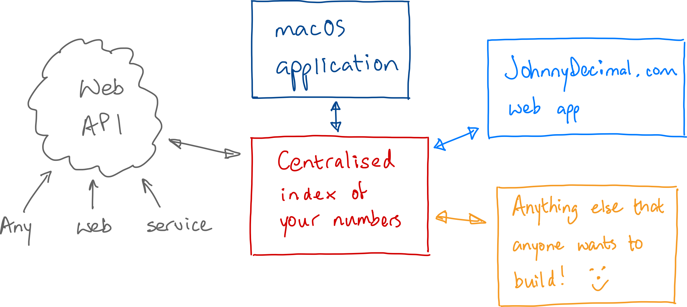
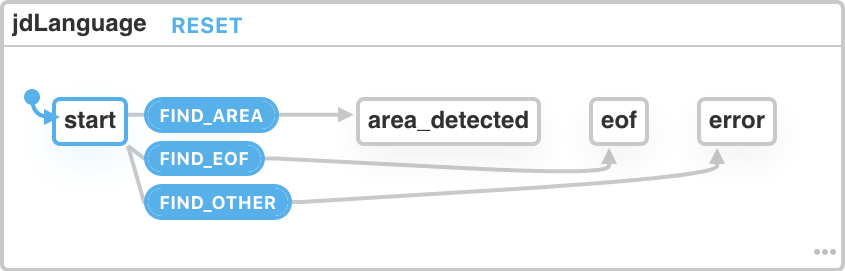
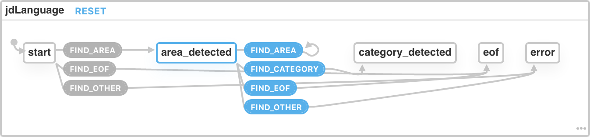
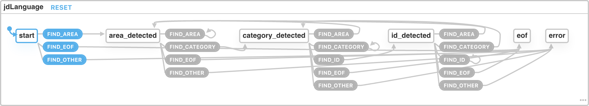

# Making a thing \(in public!\)

I've been teaching myself JavaScript and React in my spare time for a couple of years now. The goal has always been to write some sort of app to support Johnny.Decimal.

I still don't really know what that app will look like. Suggestions are welcome – tell me what you need. But in order to support anything at all it seems obvious that I'll need a structured way to store JD numbers, and some sort of interface to that data.

I'm starting to build those things, and will document their progress here. This might help you because I'm pretty new to JavaScript. Or it might not because I might get it embarrassingly wrong. Who knows.

If you do see something that I've done in a really dumb way – something that would be positively bad if someone learned from it – please do tell me. I'll correct it.

If I'm just not very good at this, well, I know! Perhaps keep that to yourself.


Twitter is the best place to get me for feedback: [@johnnydecimal](https://twitter.com/johnnydecimal).


## What are we going to build?

A language, and a language parser to make sense of it. I know right, start small.

Why a language? The first problem I have to solve is one I've been struggling with since I came up with this system in 2011: where and how do you keep your [index of numbers](https://johnnydecimal.com/concepts/tracking-your-numbers/)? The more I use the system the more convinced I become that this is a critical component of it \(but that's another post\).

So I'd like some way of saving numbers for a system, and I'd really like that to be as simple and as open as possible. I'd love to create a system that enables anyone, anywhere to be able to integrate with the JD system.



## Text rules the world

I'm a massive fan of [John Gruber's Markdown](https://daringfireball.net/projects/markdown/). It's simple, it's human-readable, it's a documented standard that anyone can 'just use'. I think my centralised index of numbers should be the same.

Here's my first crack at what this file might look like. I probably won't update this but the live version of this file is in [my public repo](https://github.com/jen729w/johnnydecimal-2020-parser/blob/feature/state-machine/language_spec/jd%20file%20spec.md).



```text
000 Project
-----------       // Optional, semantically ignored.
10-19 Area
   11 Category
   11.01 ID
   12 Category    // JS-formatted comments always allowed.
   12.01 ID
   12.02 ID
20-29 Area
   21 Category
   21.01 ID

/* Multi-line comments like this are also allowed.
   But obviously not after JD items, just on their own. */

/* But of course anything at all
      10-19 Area
   inside the comment, is a comment.
   The error case here would be if a multi-line comment was never terminated.
*/

---               // Markdown-style dividers allowed anywhere, as long as
                  // they're the only thing on a line.

002 Project
10-19 Area
                  // You don't need to define any Categories etc. underneath
                  // if you don't want to.
                  // Any number of blank lines are fine.
30-39 Area
   33 Category
   33.28 ID       // Nothing needs to start from the start, as long as it's
                  // in order. Skip as many numbers as you like.

40-49 Area
 46 Category      // Indentation is optional. Whitespace is ignored.
46.84 ID          // But prettier will do it for you on processing, unless
                  // you specify otherwise.
```



```text
999 Project
-----------
20-29 Area
10-19 Area        // Out of order [0].
   19 Category
   11 Category    // Out of order [1].
   11.02 ID
   11.01 ID       // Out of order [2].
   23 Category    // AC mismatch [3].
   32.01          // ID mismatch [4].

000 Project       // Out of order [5].
-----------
10-19 Area
   11             // Everything must have a title [7].

000 Project
   11 Category    // You can't skip a thing, in this case the Area def.

---

10-19 Area        // If there's one Project, everything needs a Project [6].

[0]: Areas must be in order within a Project.
[1]: Categories must be in order within an Area.
[2]: IDs must be in order within a Category.
[3]: Categories must follow the correct Area.
[4]: IDs must follow the correct Category.
[5]: Projects must be in order within the file.
[6]: The file must either start with a Project, or contain only one ACID.
[7]: You may not create a number without a title.
```



## That looks good \(enough for now\). What next?

Right behind Gruber's Markdown in the list of things that Johnny loves is [XState](https://xstate.js.org/docs/). 'Changed my life' is a strong description, but it's not far off.

In a nutshell, a state machine \(of which XState is an implementation\) allows you to formally define the states that _a thing_ can be in. What thing? Whatever you like. A common use-cases is a user interface: when a user clicks the **Upload** button, that button should be disabled until the upload has completed \(or is cancelled or fails or it stops being Tuesday afternoon or whatever\).

Traditionally we've done that with boolean values. `isUploading = true` and nonsense like that. Then you end up in this terrible situation where you're testing `if (isUploading && notCrashed && notCancelled && stillTuesdayAfternoon)` and that leads to all sorts of bugs. It's just the wrong way to do things.

Instead, a state machine allows you to define _states_ that a thing may be in, and _transitions_ between those states. **You can only be in one state at any time.** So now, we're sending a state machine an instruction which says 'transition from whatever state you're in now using this criteria', and it'll move to the next state \(or not\) depending on its configuration.

Your check for the upload button is now `if (machine.state === 'uploading')` which, it should be immediately obvious, is far less error-prone.

### Okay fanboy, what's this got to do with your JD language?

It occurred to me that I can use a state machine to parse my language file.

Say your file looks like this:

```text
10-19 My special area
   11 My cool category
   11.01 What a great IDea!
```

Ignoring the extended case where we have multiple projects per file \(or comments or dividers or whatever else\), in the simple case we know that the first line of your file _must be an area definition_. So we check for that, and we send the **result of the check** to the state machine.

From our **initial state** of 'just started parsing this file', there's only one thing that doesn't result in an error. That is 'area detected'. We represent this in our state machine with a transition.

The other things we might find are 'anything else', or the end of the file. We add transitions for those and we have our very first state machine.



This is a screenshot from XState's amazing visualiser. You can [play with this tiny state machine here](https://xstate.js.org/viz/?gist=12cd298a3db89e1ff7abf6d8b8e81f41).

### Add the next transition

Let's keep going. If we've just detected an area, what can legally happen next? We can detect another area, or a category:

```text
10-19 My special area
20-29 This is perfectly legal
   21 ...
```

We add those transitions to the state machine and end up [with this](https://xstate.js.org/viz/?gist=d473805a65b11ba644253108e97b5442).



Let's just [finish](https://xstate.js.org/viz/?gist=86e70ac75b1ad36a9ac4a4b5a34bbd42) this tiny state machine. The diagram starts becoming less readable but that's not important.



## That'll do for now

Now I have a state machine, but what do I do with it and how do I know what to tell it to do? This thing is getting a bit long so I'll save that for the next post.


I post a link to every new article on Twitter, so follow [@johnnydecimal](https://twitter.com/johnnydecimal) there for updates.



