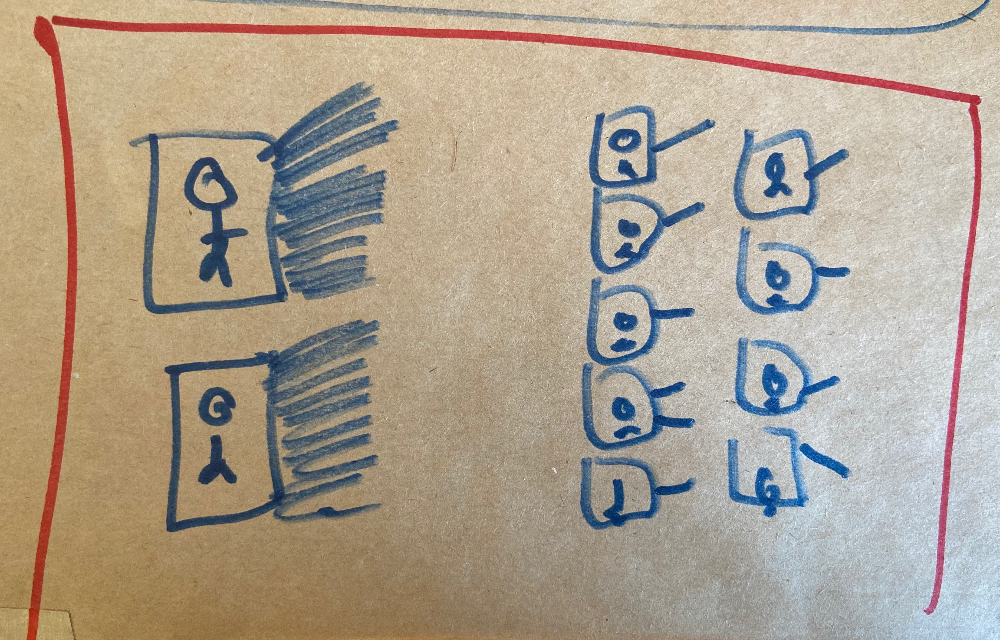
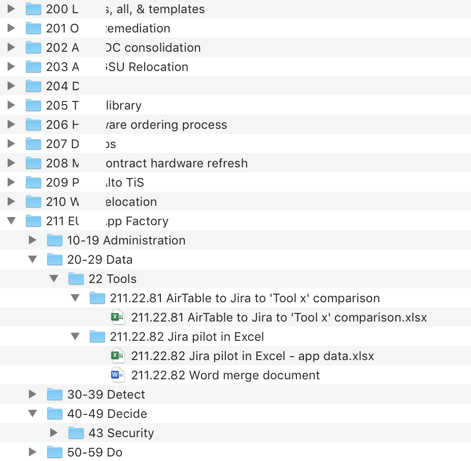

# Multiple projects

## Multiple projects, or multiple clients


This page will become a formal part of the JD system when I've thought about it some more. This is probably the thing I get asked about the most.


When I [started this system](../placeholders/the-history-of-j-d.md) I was running a specific project, and I didn't really consider the need for multiple projects _on the same computer_.

If two projects never meet, there's no issue. I have a project at work with one set of numbers and my system at home with another, totally unrelated, set of numbers. No problem at all – it's like I'm two people leading separate lives.

Fast-forward a decade and I find myself needing more. I still have my personal system, but I work as a contractor and the projects I run for other people must exist alongside my personal stuff, and each other.


If you haven't already, familiarise yourself with the [AC.ID notation](acid-notation.md).


## The problem\(s\)

If you followed my instructions, you'd probably set up a system that looked something like this.

```text
10-19 Administration
   11 ...             // Whatever

20-29 Clients
   21 Best client
   22 Another client
      22.01 Job 1
      22.02 Job 2
   23 Third client
```

A couple of problems are obvious:

1. We are going to want to create folders within `22.01 Job 1` but the system says we shouldn't do that \(and we shouldn't – don't be tempted!\).
2. This only allows us to have 10 clients.

We might try and fix it like this.

```text
10-19 Administration
   11 ...

20-29 Best client

30-39 Another client
   31 Job 1
      31.01 Requirements
      31.02 Quote
      31.03 Artwork
      31.04 External images
      31.05 Final
```

Still no good – now we can only have ~9 clients, and each client can only have 10 jobs.

This problem is an unavoidable consequence of the way that the JD system is designed: one of the **benefits** of the system is that "nothing is more than two levels deep". This is a problem when we need to structure information about clients and jobs which is itself two levels deep. We've run out of levels.

To fix it, we need to tweak the system.

## Projects vs. Clients

There are two distinct kinds of system that seem to be required.

1. You manage multiple totally separate projects. This is what I do \(I'm an IT project manager/architect by day\). Many of these projects are for the same client but they're quite distinct, different things. I'm going to call **type 1 contractor** \(or **employee**\).
2. You have one main business, and in that business you manage multiple clients, and they may have multiple jobs each. **Type 2** is your typical **freelancer**, graphic designer, writer, photographer, or any **agency** that manages this kind of work.

I fall in to type 1 above, and my partner is a type 2. I just drew this on [my desk](../random/my-desk.md).



On the left we have **type 1: contractor**. The stick-figures are clients, and the lines out are projects. That's how I tend to work. The top figure is me, personally. Actually I only have one line out and it's my `101 Personal` project. The bottom figure is the company I'm working for, and the lines are the many projects.


My `101 Personal` project is published on the [example systems](../placeholders/example-systems.md) page.


On the right we have **type 2: freelancer**. There are many clients, and each of them only has a job or two.

## Adding projects to the system

I've thought about this for a few years, and have been using the system I'll describe here since 2018. So far it's working well for me. **I would love to hear from you if you're a type 2 – it is less tested for that type of use.**

### Goals

The extended system must retain the advantages of the original Johnny.Decimal system.

1. Each item must have a unique identifier.
2. You must be able to search \(your notes, your file system\) for this identifier.
3. The identifier should be short and preferably memorable.

### Letters: no good

I tried systems using letters rather than numbers and they didn't work. My initial attempt looked something like this:

* `HME.AC.ID` = home system
* `DVO.AC.ID` = the DevOps project at work
* `ETC.AC.ID` = etc. for more projects

Now you just have to remember what those letters mean, and they don't add any semantic value to your system.

### The answer: more numbers

Here were my goals and constraints when introducing new numbers:

1. It must not confuse the system.
2. It must allow for a sufficient number of additional projects.
3. It must allow the user to organise those projects in some way \(i.e. like you organise categories in to areas\).

The solution is to **add a three-number project code to the start of your numbers**, e.g. `000.AC.ID`. In the abstract I'll refer to this as `PRO.AC.ID`. 😃

#### 1. It must not confuse the system

Three numbers is not two numbers. I think if I'd gone with `PR.AC.ID`, e.g. `10.12.53`, that would have been a bit much on the brain. The only thing in the JD system with three numbers is a project code.

#### 2. It must allow for a sufficient number of additional projects

One thousand projects should be enough for anyone. I'd love to know what you're doing if you need more than a thousand projects.

#### 3. It must allow the user to organise those projects in some way

Here's what my current system looks like. This works well for a **type 1: contractor**.

```text
100-199 Personal
  101 Personal system

200-299 ACME Corp   // The name of the company I'm contracting to
  200 ACME, general & templates
  201 Project 1
  202 Project 2
  ...
  211 Project 11    // Yeah, I'm really up to 11
```

Alternatively, you can group your projects by tens, rather than hundreds. This might work better if you're a **type 2: freelancer**.

```text
100-109 If you group like this, you get 100
110-119 divisions of 10 things each. This might
120-129 suit you if you're a freelancer with a
130-139 lot of clients, and occasionally those
140-149 clients have more than one job.
    141 Then you number your projects like this.
    141.32.73 And individual items like this.
```

Of course, you don't have to group your projects at all if you don't want or need to. In this case your projects will sort by order of creation, just like individual IDs do within a category.

```text
101 My first project
102 which I would instinctively start at 101
103 even though there's nothing wrong with the
104 numbers 000-100. There's just something
105 about reserving numbers at the 'front' of
106 a system that I find reassuring. But
107 you do whatever you want. :-)
```

## Type 1 vs. Type 2

If you're a **type 1 contractor** like me, this is probably all you need. Because each of your projects is likely to be quite large, you won't have that _many_ projects. In this case just treat each one as its own separate thing, with its own unique area/category structure which you basically start from scratch each time.

You might find you have some similarities between projects, which you should [aggressively identify and optimise](../placeholders/common-area-category-patterns.md). This is where JD makes you better at your job.

It is extra important—and I've learned this the hard way—that you track your numbers effectively if you have multiple projects. I realise this is difficult and am working on making it easier but, believe me, if you don't do it you'll regret it.

### Side note on this whole tracking-numbers thing

I do appreciate that keeping an index of numbers is an overhead. But I think for the 1% cost this incurs, you get 10% back. I'll expand on this when I get more time.

### Type 2 freelancer \(designer/writer/photographer/agency/...\)

If you're a **type 2 freelancer**, at this point you might be wondering if I've really solved your problem or whether I've just given you a bunch of numbers to track.

Your situation is different. All of your projects are, if not the _same_, at least very _similar_. I bet you could draw the structure of one of your projects on a whiteboard now without even thinking about it. You've got a specification/request, the financial stuff, assets, the actual work which you produce, and final/approved versions which go out.

**Standardise this and create a template.**

## Implementation details

### \(Probably\) keep one project for your overall administration

For most people who are in this situation, I _think_ you should use one project for all of the stuff that is general to your life/business/etc.

So what I mean is we go from something like this.

```text
10-19 Administration
20-29 Marketing
   21 Advertising
30-39 Finance
   31 Accounting
   32 Contracts
40-49 Clients
   41 ...                   // This is what didn't work
   42 ...
```

...to this.

```text
101 Administration          // This is all the stuff
    10-19 Administration    // from above, just in its
    20-29 Marketing         // own 'project'.
       21 Advertising
    30-39 Finance
       31 Accounting
       32 Contracts
102 First project           // And now we break out
    10-19 ...               // all of the actual projects
    20-29 ...               // as discussed above.
103 Second project
    10-19 ...
```

### My actual work folder

Here's my actual `200-299 <Company>` folder, obfuscated for privacy.



I don't use the project number in my area or category folders. This is because they tend to be fairly unique anyway, with the exception of my ubiquitous [10-19 Administration](../placeholders/10-19-administration.md).

I **do** use the project number in my ID folders, and when I name files. There are a couple of reasons why I've found this to be right for me.

1. When I use [Alfred](https://www.alfredapp.com), which I do many times a day, I can type the full `PRO.AC.ID` number and it'll open the folder immediately. \(If you use macOS, you should use Alfred. Install it, activate it, press the spacebar, then type the name of a folder. 🤯\)
2. When you view the _Open Recent_ menu—e.g. in Microsoft Excel—the filename shows the project name at the beginning. I find this really useful.

As with most aspects of this system, you should adapt it to your needs. Try a few things and see what works. Change often – don't think that the first way you implement a thing will be the right one, I've found it needs experimentation to get just right.

## I'm still working on this

There's work to be done here. If this feels confusing, it's because I'm confused! 😜 [Mail me](mailto:hello@johnnydecimal.com) and we can work it out together.

