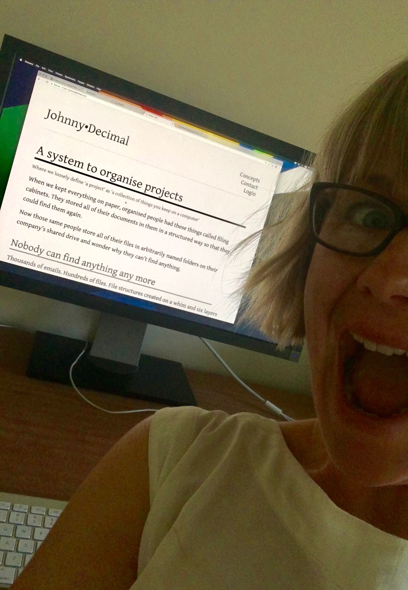
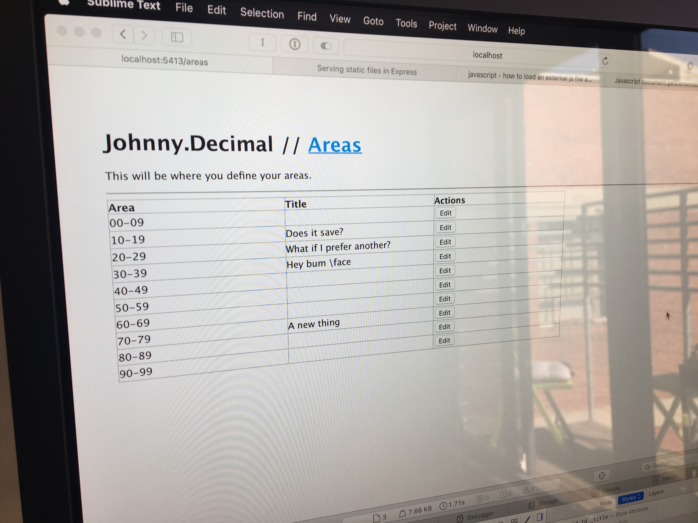
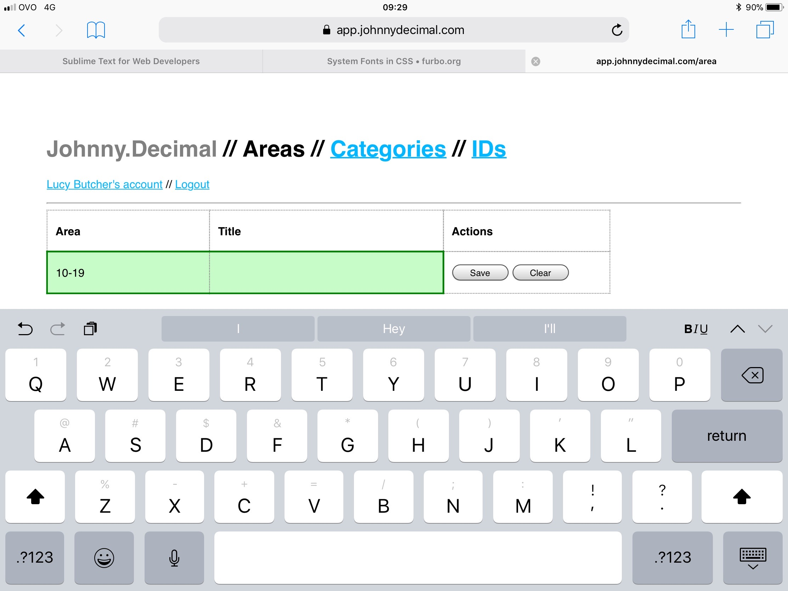
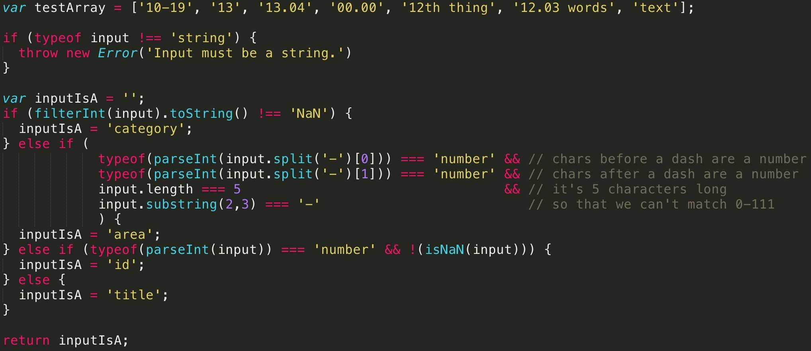
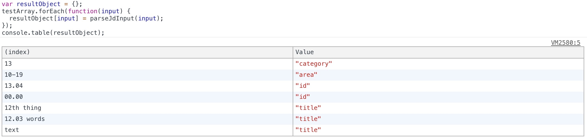

# The museum

I started learning JavaScript in late 2017 and am obviously using JD as my 'demo project'. I wish there were more, but here are the photos/screenshots that I've taken.

This stuff looks comically bad now but at the time I couldn't believe _I'd made this!_ If you're learning something, stick with it. It's worth it.

An early version of the main website. Probably hand-coded in raw HTML.

The first ever app! Unstyled HTML, I think this had an Express back-end. This is before I discovered React.

A bit more styling. The screenshots come from my partner who I was messaging with great excitement. "Look at what I can do!"

Before I discovered that you can use regular expressions in JS. Still, it works...

